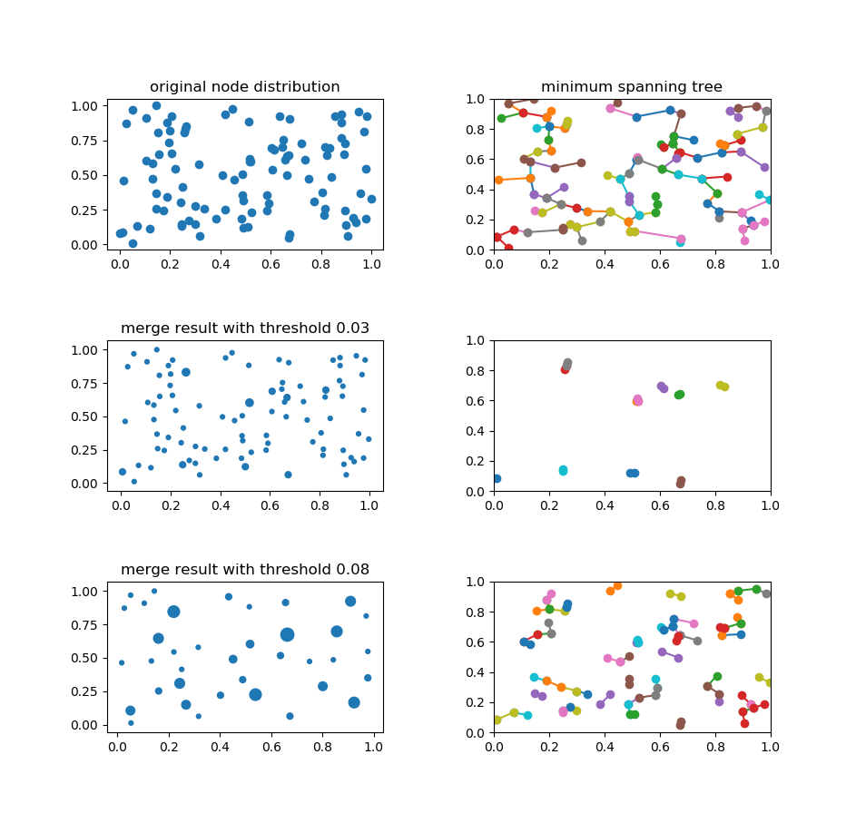

# merge_near_spots

Execute clustering of 2d nodes using Euclidean distance.

Each two nodes within specified distance are merged together.

## target Python version

python 3.5.1 or later

## usage

```
pip install -r requirements.txt
python merge_near_spots.py
```

## result image

